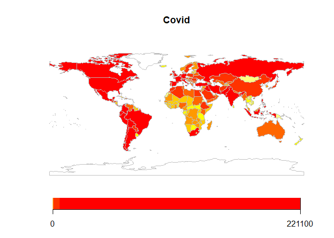
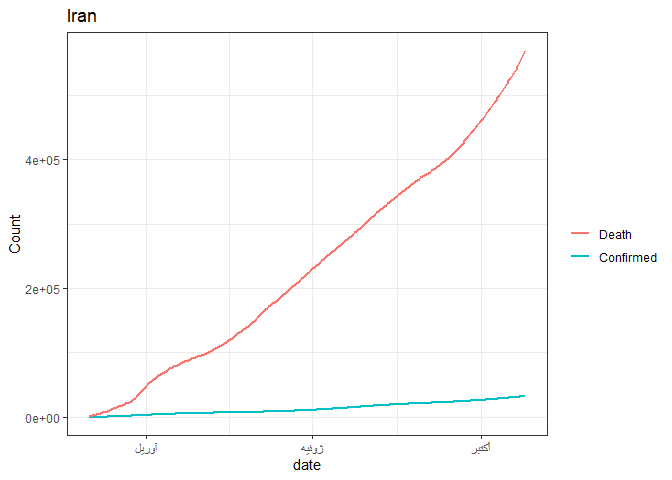

<!-- README.md is generated from README.Rmd. Please edit that file -->

# covid19

<!-- badges: start -->

<!-- badges: end -->

The goal of covid19 is to visualize Covid-19 pandemic trends based on
updated, clean data

## Installation

And the development version from [GitHub](https://github.com/) with:

``` r
# install.packages("devtools")
devtools::install_github("Ashkan-nmt/covid19")
```

## Example

This is a basic example which shows you how to solve a common problem:

``` r
library(covid19)

covid_world_map("2020-10-20","death")
#> 182 codes from your data successfully matched countries in the map
#> 8 codes from your data failed to match with a country code in the map
#> 61 codes from the map weren't represented in your data
```



``` r

covid_country_plot("Iran","2020-03-01","2020-10-25")
```


